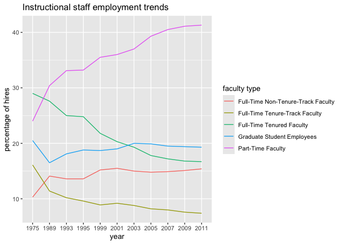

Lab 06 - Ugly charts and Simpson’s paradox
================
Allison Li
02142025

### Email and name

``` r
library(usethis)
use_git_config(
  user.name = "Allison",
  user.email = "liy423@gmail.com"
)
```

### Load packages and data

``` r
library(tidyverse) 
library(dsbox)
library(mosaicData) 
staff <- read_csv("data/instructional-staff.csv")
```

### Exercise 1

``` r
staff_long <- staff %>%
  pivot_longer(cols = -faculty_type, names_to = "year") %>%
  mutate(value = as.numeric(value))
staff_long
```

    ## # A tibble: 55 × 3
    ##    faculty_type              year  value
    ##    <chr>                     <chr> <dbl>
    ##  1 Full-Time Tenured Faculty 1975   29  
    ##  2 Full-Time Tenured Faculty 1989   27.6
    ##  3 Full-Time Tenured Faculty 1993   25  
    ##  4 Full-Time Tenured Faculty 1995   24.8
    ##  5 Full-Time Tenured Faculty 1999   21.8
    ##  6 Full-Time Tenured Faculty 2001   20.3
    ##  7 Full-Time Tenured Faculty 2003   19.3
    ##  8 Full-Time Tenured Faculty 2005   17.8
    ##  9 Full-Time Tenured Faculty 2007   17.2
    ## 10 Full-Time Tenured Faculty 2009   16.8
    ## # ℹ 45 more rows

``` r
staff_long %>%
  ggplot(aes(x = year, y = value, color = faculty_type)) +
  geom_line()
```

    ## `geom_line()`: Each group consists of only one observation.
    ## ℹ Do you need to adjust the group aesthetic?

<!-- -->

``` r
staff_long %>%
  ggplot(aes(
    x = year,
    y = value,
    group = faculty_type,
    color = faculty_type
  )) +
  geom_line() +
  labs(title = "Instructional staff employment trends",
       y = "percentage of hires",
       color = "faculty type")
```

<!-- -->

According to the graph, we can clearly see that the Part-Time faculty
employment trend has increased over the years while the Full-time
Tenure-track Faculty and the Full-time Tenured Faculty showed clear
decreasing trends. For Full-time Non-Tenured-Track Faculty, it seems
that there are higher employment rate in 2011 comparing with 1975. For
Graduate Student Employees, although there is a clear decrease in 1989,
the rest employment rate remained relatively similar over the years,
around 20%.

### Exercise 2

If I want to show the trend of the part-time faculty employment rate
comparing with other staff types, I would either make other types of
faculty type different types of color grey, or I would make this line
thicker so people would know what is the main point of my graph.  
Additionally, I believe we can also re-code the variables into part-time
faculty and other types of faculty to highlight the comparison.

``` r
##I plan to use one line with color to represent part-time faculty employment rate trend while keep other lines grey to represent other instructional staff types.

staff_long %>%
  mutate(faculty_type_compare = if_else(faculty_type == "Part-Time Faculty", "Part-Time Faculty", "other")) %>% 
  ggplot(aes(
    x = year,
    y = value,
    group = faculty_type,
    color = faculty_type_compare
  )) +
  geom_line(size = 1) +
  scale_color_manual(values = c("Part-Time Faculty" = "#FF007F", "other" = "gray")) +
  labs(title = "Instructional staff employment trends comparison",
       y = "percentage of hires",
       color = "faculty type")
```

    ## Warning: Using `size` aesthetic for lines was deprecated in ggplot2 3.4.0.
    ## ℹ Please use `linewidth` instead.
    ## This warning is displayed once every 8 hours.
    ## Call `lifecycle::last_lifecycle_warnings()` to see where this warning was
    ## generated.

<!-- -->

### Exercise 3

``` r
##In my understanding, I believe one of the best ways to make a better visualization is to make a bar chart for the top 10 countries with the most fish caught and farmed.
fisheries <- read_csv("data/fisheries.csv")
```

    ## Rows: 216 Columns: 4
    ## ── Column specification ────────────────────────────────────────────────────────
    ## Delimiter: ","
    ## chr (1): country
    ## dbl (3): capture, aquaculture, total
    ## 
    ## ℹ Use `spec()` to retrieve the full column specification for this data.
    ## ℹ Specify the column types or set `show_col_types = FALSE` to quiet this message.

``` r
##the top ten countries for farming fish
top10_aquaculture <- fisheries %>%
  arrange(desc(aquaculture)) %>%
  slice_head(n = 10)
##The top ten countries for fish caught
top10_capture <- fisheries %>%
  arrange(desc(capture)) %>%
  slice_head(n = 10)

##since the top ten countries for farming and capturing are different, I decided to make two bar chart with one for each. 
##Top 10 countries of capture fish visualization
top_countries_capture <- top10_capture %>%
  pivot_longer(cols = c(aquaculture, capture), names_to = "type", values_to = "production")

ggplot(top_countries_capture, aes(x = reorder(country, -production), y = production, fill = type)) +
  geom_bar(stat = "identity", position = "dodge") + 
  coord_flip() +
  labs(title = "Top 10 Countries in Fisheries Capture (Aquaculture vs. Capture)",
       x = "Country",
       y = "Production (metric tons)",
       fill = "Production Type")    
```

<!-- -->

``` r
##Top 10 countries of farming fish visualization
top_countries_farm <- top10_aquaculture %>%
  pivot_longer(cols = c(aquaculture, capture), names_to = "type", values_to = "production")

ggplot(top_countries_farm, aes(x = reorder(country, -production), y = production, fill = type)) +
  geom_bar(stat = "identity", position = "dodge") + 
  coord_flip() +
  labs(title = "Top 10 Countries in Fisheries Farm (Aquaculture vs. Capture)",
       x = "Country",
       y = "Production (tons)",
       fill = "Production Type")  
```

<!-- -->

### Exercise 4

``` r
###install.packages("mosaicData")
###install.packages("performance")
library(tidyverse)
library(mosaicData)
library(ggplot2)

data(Whickham)
?Whickham
```

4.1. According to the codebook, I think the data comes from
observational data. Because it is simply asking questions including the
age of the participant, whether the participant is dead of alive
(outcome), and whether the participant smoke or not. These questions are
not manipulated or controled, so this is an observation. 4.2. There are
1314 observations in the dataset, with each of them representing the
basic information for each participant about whether they smoke or not,
age, and the living outcomes. 4.3. There are three variables. The
outcome variable is categorical variable; The smoker variable is
categorical variable; The age variable is numeric variable.

``` r
##outcome visualization
ggplot(Whickham, aes(x = outcome, fill = outcome)) +
  geom_bar() +
  labs(title = "Bar Graph for Outcome of Smokers", x = "outcome", y = "number")
```

<!-- -->

``` r
##smoker variable visualization
ggplot(Whickham, aes(x = smoker, fill = smoker)) +
  geom_bar() +
  labs(title = "Bar Graph for number of Smokers", x = "Smokers", y = "Number")
```

<!-- -->

``` r
##age variable visualization
ggplot(Whickham, aes(x = "I can put anything here!", y = age)) +
  geom_violin() +
  labs(title = "Violin Plot of Age", x = "Age")
```

<!-- -->

``` r
##We have found if we only need one violin plot, we will have to assign x asix with something since it is requiring one. This can be anything label/ names!
```

4.4. I expect there might be a liner slightly positive relationship
between smoking status and health outcome, indicating that smoking is
positively correlated with dead. 4.5.

``` r
Whickham %>%
  count(smoker, outcome)
```

    ##   smoker outcome   n
    ## 1     No   Alive 502
    ## 2     No    Dead 230
    ## 3    Yes   Alive 443
    ## 4    Yes    Dead 139

``` r
##After looking at the dataframe, I decided to create a bar plot
 ggplot(Whickham, aes(x = smoker, fill = outcome)) + 
        geom_bar(position = "dodge") +
   labs(title = "Number of Alive vs. Dead by Smoking Status", 
       x = "Smoking Status", 
       y = "Count")
```

<!-- -->
Based on the bar chart, we can see that for people who smoking, the
death rate seems to be smaller than the group of people who smoke.

4.6.

``` r
Whickham <- Whickham %>%
  mutate(age_cat = case_when(
    age <= 44 ~ "18-44",
    age > 44 & age <= 64 ~ "45-64",
    age > 64 ~ "65+"
    ))
```

4.7.

``` r
Whickham %>%
  count(smoker, age_cat, outcome)
```

    ##    smoker age_cat outcome   n
    ## 1      No   18-44   Alive 327
    ## 2      No   18-44    Dead  12
    ## 3      No   45-64   Alive 147
    ## 4      No   45-64    Dead  53
    ## 5      No     65+   Alive  28
    ## 6      No     65+    Dead 165
    ## 7     Yes   18-44   Alive 270
    ## 8     Yes   18-44    Dead  15
    ## 9     Yes   45-64   Alive 167
    ## 10    Yes   45-64    Dead  80
    ## 11    Yes     65+   Alive   6
    ## 12    Yes     65+    Dead  44

``` r
Whickham %>%
  ggplot(aes(x = smoker, color = outcome, fill = outcome)) + 
  geom_bar(position = "dodge") +
  facet_wrap(~ age_cat) +
  labs(x = "Health outcome", y = "Number") +
  ggtitle("Smoker vs. Non-smoker Health Outcome")
```

<!-- -->
Based on the graph, it seems like the relationship differs for different
age groups. For people aging from 45 to 64, people who smoke has a
higher death rate, while for other two age groups, people who smoke
seems to have a smaller death rate.
